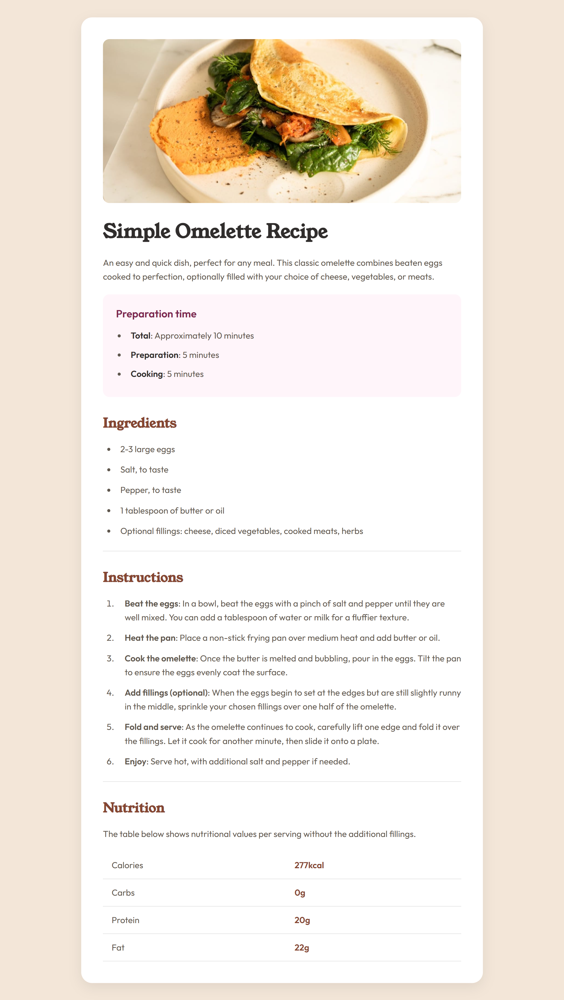

<p align="center">
  
</p>
<p align="center">
    
</p>

<h2 align="center">🥗 A Taste of Design. A Pinch of Code. Fully Responsive.</h2>

---

<p align="center">
  
  
</p>

---

### 💡 Who’s It For?

- 🍳 Food lovers who want a digital recipe card  
- 👩‍💻 Beginners learning HTML & CSS  
- 🎨 Designers exploring responsive layouts  
- 🚀 Developers building a clean portfolio project  

---

### 📂 Folder Blueprint

```plaintext
📁 Gourmet-Recipe-Card/
├── 📂 assets/
│   └── 📂 images/
│       ├── image-omelette.jpeg
│       └── screenshot.png
├── 🗂️ index.html
├── 🎨 styles.css
├── 📄 README.md
````

---

### 🛠️ Under the Hood

* **HTML5** – Semantic layout and structure
* **CSS3** – Styling, responsiveness, media queries
* *(Optional Future)* JavaScript for interactivity

---

### 🔭 Roadmap & Future Plans

* 🌗 Dark/Light mode toggle
* 📖 Multiple recipe support
* ✨ Interactive version with JavaScript
* 🧩 Theme customization

---

### 🙌 Thanks To

* **Myself 😎** – for designing, coding, and launching
* **Frontend Mentor** – for challenging all the web developers out there
* **HTML & CSS** – for giving this project its shape and speed
* **Vision + Curiosity** – for pushing me to make it better

---

<p align="center">
  <br><br>
  <b>Cook with Code. Serve with Style.</b><br>
  <i>~ Cipher Shadow IR (Ishaan Ray)</i>
</p>
